# vFeed

[https://vfeed.io/](https://vfeed.io/)

## Overview

vFeed technology and engines transforms big data into correlated vulnerability and threat intelligence database and multi-formats feeds. vFeeds are focused 100% into perfecting the optimum product to empower customers technology and threat intelligence solutions.  Protecting vulnerable and sensitive systems, enabling clients to rapidly detect and react against cyber-attacks.

vFeed worldwide client base comprises of a wide and diverse range of individuals and businesses from hackers, consultancy firms, CERTs and freelancers to  governmental organizations, software companies and intelligence providers.

## Lookups integrated with vFeed

##### Note

`testingintegrations` is a DNIF event store that can be uploaded for testing.

### Search for CVE IDs by Keyword

Returns a list of CVEs whose description matches the input description

- input : a keyword that matches a CVE

```
_fetch $Keyword from testingintegrations limit 1
>>_lookup vfeed search_for_cve $Keyword
```

###### Sample walkthrough screenshot for CVE Search


The lookup call returns output in the following structure for available data:

|Field|Description|
|-|-|
| $Keyword | The keyword to search for in CVE database |
| $CVE | CVE that matched the given keyword |
| $CVESummary | Summary of the CVE that matched the given keyword |

### Retrieve CVE ID for Snort ID

CVE ID for the entered Snort ID

- input : a SID

```
_fetch $SID from testingintegrations limit 1
>>_lookup vfeed sid_to_cve $SID
```

###### Sample walkthrough screenshot for SID to CVE


The lookup call returns output in the following structure for available data:

| File |          Description          |
|------|-------------------------------|
| $CVE | CVE ID for the Snort ID       |
| $SID | Snort ID of the vulnerability |

### Retrieve ExploitDB ID for CVE ID

ExploitDB ID for the entered CVE ID

- input : a CVE ID

```
_fetch $CVE from testingintegrations limit 1
>>_lookup vfeed cve_to_exploitdb $CVE
```

###### Sample walkthrough screenshot for CVE to Exploit DB ID

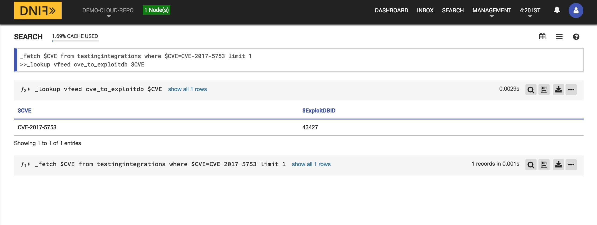

The lookup call returns output in the following structure for available data:

|     File     |           Description             |  
|--------------|-----------------------------------|
| $ExploitDBID | ExploitDB ID of the vulnerability |
| $CVE         | CVE ID of the vulnerability       |

### Retrieve D2 Elliot exploit details by CVE ID

Returns D2 Elliot exploit information about the given CVE including D2 Elliot titles, and filenames.

- input : a CVE ID

```
_fetch $CVE from testingintegrations limit 1
>>_lookup vfeed get_d2 $CVE
```

###### Sample walkthrough screenshot for D2 Elliot


The lookup call returns output in the following structure for available data:

|Field|Description|
|-|-|
| $CVE| CVE being queried |
| $VFd2ScriptName | Script names associated with this CVE |
| $VFd2ScriptURLs | D2 Exploit URLs for more information on the associated script |

### Retrieve Exploit DB exploit details by CVE ID

Returns Exploit DB information about the given CVE including IDs, Script names, and EDB URLs

- input : a CVE ID

```
_fetch $CVE from testingintegrations limit 1
>>_lookup vfeed get_edb $CVE
```

###### Sample walkthrough screenshot for Exploit DB

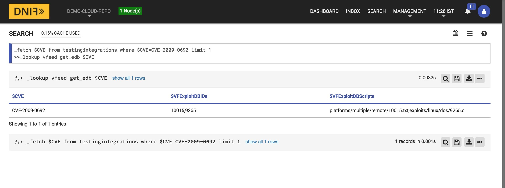

The lookup call returns output in the following structure for available data:

|Field|Description|
|-|-|
| $CVE | CVE being queried |
| $VFExploitDBIDs | Exploit DB IDs for the given CVE |
| $VFExploitDBScripts | Exploit DB Script names for the given CVE |
| $VFExploitDBURLs | Exploit DB URLs for more information on the associated script |

### Retrieve Metasploit exploit details by CVE ID

Returns Metasploit information about the given CVE including Metaploit IDs, MSF resource locators, and Script names

- input : a CVE ID

```
_fetch $CVE from testingintegrations limit 1
>>_lookup vfeed get_msf $CVE
```

###### Sample walkthrough screenshot for Metasploit


The lookup call returns output in the following structure for available data:

|Field|Description|
|-|-|
| $CVE| CVE being queried |
| $VFMsfIDs | Metasploit IDs for the given CVE |
| $VFMsfScriptFiles | Metasploit framework file resource locators for the given CVE |
| $VFMsfScriptNames | Metasploit Scrtip names for the given CVE |

### Retrieve Saint exploit details by CVE ID

Returns Saint exploit information about the given CVE including Saint IDs, and exploit titles

- input : a CVE ID

```
_fetch $CVE from testingintegrations limit 1
>>_lookup vfeed get_saint $CVE
```

###### Sample walkthrough screenshot for Saint


The lookup call returns output in the following structure for available data:

|Field|Description|
|-|-|
| $CVE| CVE being queried |
| $VFSaintExploitID | Saint IDs for the given CVE |
| $VFSaintExploitTitles | Saint exploit Titles for the given CVE |

### Retrieve CAPEC information by CVE ID

Returns CAPEC details for each CWE linked to the given CVE including CAPEC IDs, Titles, and steps for mitigations

- input : a CVE ID

```
_fetch $CVE from testingintegrations limit 1
>>_lookup vfeed get_capec $CVE
```

###### Sample walkthrough screenshot for CAPEC


The lookup call returns output in the following structure for available data:

|Field|Description|
|-|-|
| $CVE| CVE being queried |
| $VFCweID | CWE linked with the given CVE |
| $VFCapecIDs | CAPEC IDs for the given CWE |
| $VFCapecTitles | CAPEC Titles for the given CWE |
| $VFCapecURLs | CAPEC Mitre URLs for more information on the given CWE |
| $VFCapecMitigations | List of mitigations for the given CWE |

### Retrieve CWE Weakness Category information by CVE ID

Returns CWE Weaknesses Category details (as Top 2011, CERT C++, Top 25, OWASP ....) for each CWE matched to the given CVE

- input : a CVE ID

```
_fetch $CVE from testingintegrations limit 1
>>_lookup vfeed get_category $CVE
```

###### Sample walkthrough screenshot for CWE Category

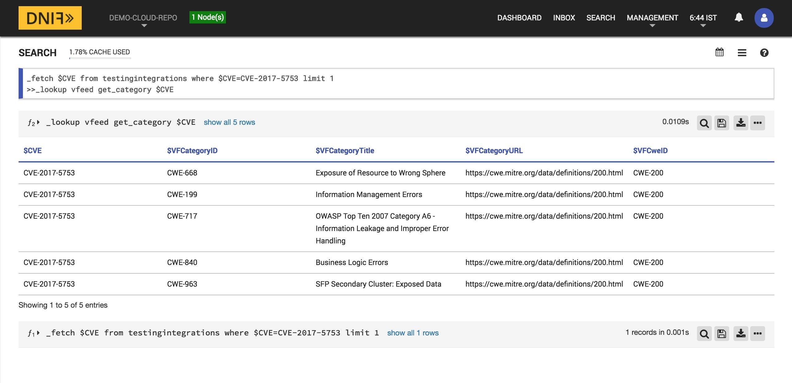

The lookup call returns output in the following structure for available data:

|Field|Description|
|-|-|
| $CVE| CVE being queried |
| $VFCweID | CWE linked with the given CVE |
| $VFCategoryID | Category ID for the given CWE |
| $VFCategoryTitle | Category Titles for the given CWE |
| $VFCategoryURL | Category URL for more information on the given CWE |

### Retrieve CPE ID by CVE ID

Returns CPE ID information about the given CVE

- input : a CVE ID

```
_fetch $CVE from testingintegrations limit 1
>>_lookup vfeed get_cpe $CVE
```

###### Sample walkthrough screenshot for CPE ID


The lookup call returns output in the following structure for available data:

|Field|Description|
|-|-|
| $CVE| CVE being queried |
| $VFCPE | CPE IDs linked to the given CVE |

### Retrieve more information about a CVE ID

Returns additional verbose information about the given CVE including date published, date modified, and a verbose summary.

- input : a CVE ID

```
_fetch $CVE from testingintegrations limit 1
>>_lookup vfeed get_cve $CVE
```

###### Sample walkthrough screenshot for CVE info

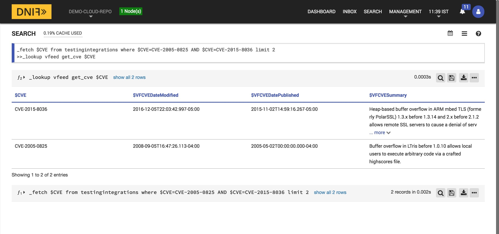

The lookup call returns output in the following structure for available data:

|Field|Description|
|-|-|
| $CVE| CVE being queried |
| $VFCVEDatePublished | The date the CVE was first published |
| $VFCVEDateModified | The date the CVE was last modified |
| $VFCVESummary | A verbose summary of the the given CVE |

### Retrieve CWEs by CVE ID

Returns a list of CWE IDs linked to the given CVE

- input : a CVE ID

```
_fetch $CVE from testingintegrations limit 1
>>_lookup vfeed get_cwe $CVE
```

###### Sample walkthrough screenshot for getting CWE

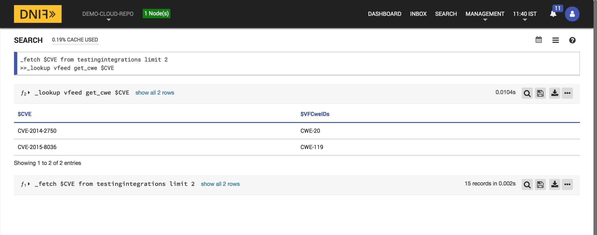

The lookup call returns output in the following structure for available data:

|Field|Description|
|-|-|
| $CVE| CVE being queried |
| $VFCweIDs | List of CWE IDs linked to the given CVE |

### Retrieve WASC information by CVE ID

Returns Web Application Consortium details for each CWE linked to the given CVE

- input : a CVE ID

```
_fetch $CVE from testingintegrations limit 1
>>_lookup vfeed get_wasc $CVE
```

###### Sample walkthrough screenshot for getting WASC information

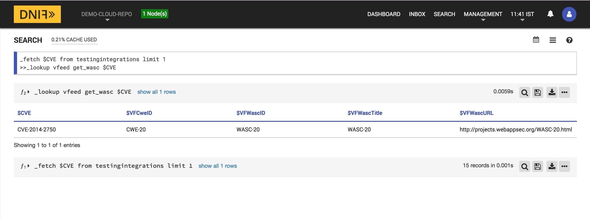

The lookup call returns output in the following structure for available data:

|Field|Description|
|-|-|
| $CVE| CVE being queried |
| $VFCweID | CWE linked with the given CVE |
| $VFWascID | CWE linked to the given CVE |
| $VFWascTitle | CWE linked to the given CVE |
| $VFWascID | CWE linked to the given CVE |

### Retrieve IBM Aixapar patches by CVE ID

Returns IBM Aixapar patch details for the given CVE

- input : a CVE ID

```
_fetch $CVE from testingintegrations limit 1
>>_lookup vfeed get_aixapar $CVE
```

###### Sample walkthrough screenshot for IBM Aixapar

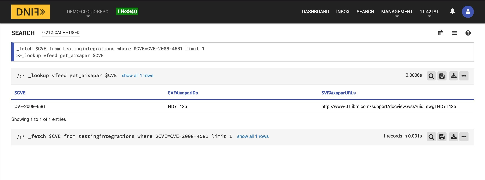

The lookup call returns output in the following structure for available data:

|Field|Description|
|-|-|
| $CVE| CVE being queried |
| $VFAixaparIDs | IBM Aixapar patch IDs for the given CVE |
| $VFAixaparURLs | IBM Aixapar patch URLs for more information about the given CVE |

### Retrieve Cisco patches by CVE ID

Returns Cisco patch details for the given CVE

- input : a CVE ID

```
_fetch $CVE from testingintegrations limit 1
>>_lookup vfeed get_cisco $CVE
```

###### Sample walkthrough screenshot for Cisco


The lookup call returns output in the following structure for available data:

|Field|Description|
|-|-|
| $CVE| CVE being queried |
| $VFCiscoIDs | Cisco patch IDs for the given CVE |

### Retrieve Debian patches by CVE ID

Returns Debian patch details for the given CVE

- input : a CVE ID

```
_fetch $CVE from testingintegrations limit 1
>>_lookup vfeed get_debian $CVE
```

###### Sample walkthrough screenshot for Debian


The lookup call returns output in the following structure for available data:

|Field|Description|
|-|-|
| $CVE| CVE being queried |
| $VFDebianIDs | Debian patch IDs for the given CVE |
| $VFDebianURLs | Debian patch URLs for more information about the given CVE |

### Retrieve Fedora patches by CVE ID

Returns Fedora patch details for the given CVE

- input : a CVE ID

```
_fetch $CVE from testingintegrations limit 1
>>_lookup vfeed get_fedora $CVE
```

###### Sample walkthrough screenshot for Fedora

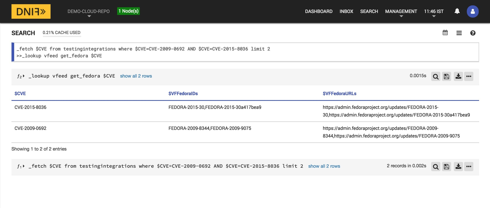

The lookup call returns output in the following structure for available data:

|Field|Description|
|-|-|
| $CVE| CVE being queried |
| $VFFedoraIDs | Fedora patch IDs for the given CVE |
| $VFFedoraURLs | Fedora patch URLs for more information about the given CVE |

### Retrieve Gentoo patches by CVE ID

Returns Gentoo patch details for the given CVE

- input : a CVE ID

```
_fetch $CVE from testingintegrations limit 1
>>_lookup vfeed get_gentoo $CVE
```

###### Sample walkthrough screenshot for Gentoo

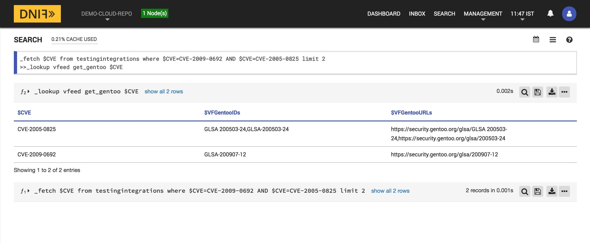

The lookup call returns output in the following structure for available data:

|Field|Description|
|-|-|
| $CVE| CVE being queried |
| $VFGentooIDs | Gentoo patch IDs for the given CVE |
| $VFGentooURLs | Gentoo patch URLs for more information about the given CVE |

### Retrieve HP patches by CVE ID

Returns HP patch details for the given CVE

- input : a CVE ID

```
_fetch $CVE from testingintegrations limit 1
>>_lookup vfeed get_hp $CVE
```

###### Sample walkthrough screenshot for HP


The lookup call returns output in the following structure for available data:

|Field|Description|
|-|-|
| $CVE| CVE being queried |
| $VFHpIDs | HP patch IDs for the given CVE |
| $VFHpURLs | HP patch URLs for more information about the given CVE |

### Retrieve Mandriva patches by CVE ID

Returns Mandriva patch details for the given CVE

- input : a CVE ID

```
_fetch $CVE from testingintegrations limit 1
>>_lookup vfeed get_mandriva $CVE
```

###### Sample walkthrough screenshot for Mandriva


The lookup call returns output in the following structure for available data:

|Field|Description|
|-|-|
| $CVE| CVE being queried |
| $VFMandrivaIDs | Mandriva patch IDs for the given CVE |
| $VFMandrivaURLs | Mandriva patch URLs for more information about the given CVE |

### Retrieve Microsoft patches by CVE ID

Returns Microsoft patch details for the given CVE

- input : a CVE ID

```
_fetch $CVE from testingintegrations limit 1
>>_lookup vfeed get_microsoft $CVE
```

###### Sample walkthrough screenshot for Microsoft

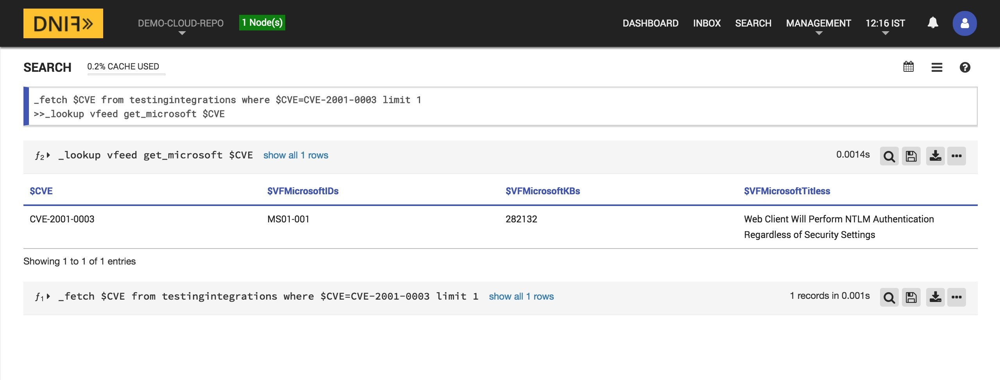

The lookup call returns output in the following structure for available data:

|Field|Description|
|-|-|
| $CVE| CVE being queried |
| $VFMicrosoftIDs | Microsoft patch IDs for the given CVE |
| $VFMicrosoftURLs | Microsoft patch URLs for more information about the given CVE |

### Retrieve Redhat vulnerabilities by CVE ID

Report on the vulnerabilities in Redhat associated with the given CVE ID

- input : a CVE ID

```
_fetch $CVE from testingintegrations limit 1
>>_lookup vfeed get_redhat $CVE
```

###### Sample walkthrough screenshot for Redhat

[Redhat Walkthrough Video Link](https://drive.google.com/file/d/1Q_cP9K8ZbizMuvhakY-0f-NCWqV_s4w2/view?usp=sharing)

The lookup call returns output in the following structure for available data:

|      Field        |                     Description                           |
|-------------------|-----------------------------------------------------------|
| $CVE              | The CVE ID of the vulnerability                           |
| $VFRedhatCVE      | The Redhat CVE ID                                         |
| $VFRedhatCategory | Category of the vulneratibility (i.e. Bugzilla or Redhat) |
| $VFRedhatId       | The vulnerability ID for Redhat                           |
| $VFRedhatUrl      | URL for the Redhat vulnerability                          |

### Retrieve Suse vulnerabilities by CVE ID

Report on the vulnerabilities in Suse associated with the given CVE ID

- input : a CVE ID

```
_fetch $CVE from testingintegrations limit 1
>>_lookup vfeed get_suse $CVE
```

###### Sample walkthrough screenshot for Suse


The lookup call returns output in the following structure for available data:

|    Field   |         Description             |
|------------|---------------------------------|
| $CVE       | The CVE ID of the vulnerability |
| $VFSuseId  | The Suse CVE ID                 |
| $VFSuseUrl | URL for the Suse vulnerability  |

### Retrieve Ubuntu vulnerabilities by CVE ID

Report on the vulnerabilities in Ubuntu associated with the given CVE ID

- input : a CVE ID

```
_fetch $CVE from testingintegrations limit 1
>>_lookup vfeed get_ubuntu $CVE
```

###### Sample walkthrough screenshot for Ubuntu

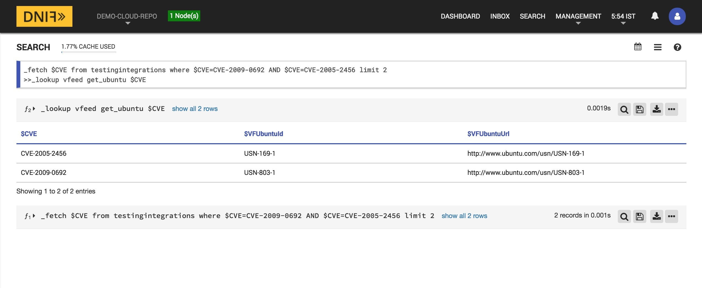

The lookup call returns output in the following structure for available data:

|     Field     |          Description              |
|---------------|-----------------------------------|
| $CVE          | The CVE ID of the vulnerability   |
| $VFUbuntueId  | The Ubuntu CVE ID                 |
| $VFUbuntuUrl  | URL for the Ubuntu vulnerability  |

### Retrieve VMWare vulnerabilities by CVE ID

Report on the vulnerabilities in VMWare associated with the given CVE ID

- input : a CVE ID

```
_fetch $CVE from testingintegrations limit 1
>>_lookup vfeed get_vmware $CVE
```

###### Sample walkthrough screenshot for VMWare

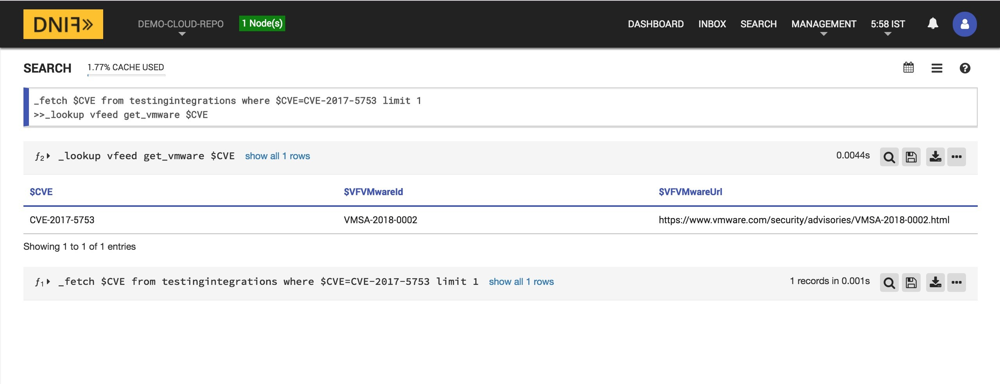

The lookup call returns output in the following structure for available data:

|     Field      |          Description              |
|----------------|-----------------------------------|
| $CVE           | The CVE ID of the vulnerability   |
| $VFVMWreareId  | The VMWare CVE ID                 |
| $VFVMWareUrl   | URL for the VMWare vulnerability  |

### Retrieve BID(Security Focus) vulnerabilities by CVE ID

Report on the vulnerabilities from BID(Security Focus) associated with the given CVE ID

- input : a CVE ID

```
_fetch $CVE from testingintegrations limit 1
>>_lookup vfeed get_bid $CVE
```

###### Sample walkthrough screenshot for BID

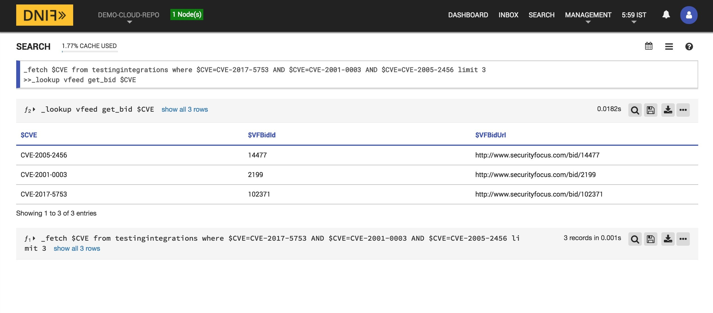

The lookup call returns output in the following structure for available data:

|     Field   |              Description                       |
|-------------|------------------------------------------------|
| $CVE        | The CVE ID of the vulnerability                |
| $VFBidId    | The BID(Security Focus) CVE ID                 |
| $VFBidUrl   | URL for the BID(Security Focus) vulnerability  |

### Retrieve CertVN vulnerabilities by CVE ID

Report on the vulnerabilities from CertVN associated with the given CVE ID

- input : a CVE ID

```
_fetch $CVE from testingintegrations limit 1
>>_lookup vfeed get_certvn $CVE
```

###### Sample walkthrough screenshot for CertVN

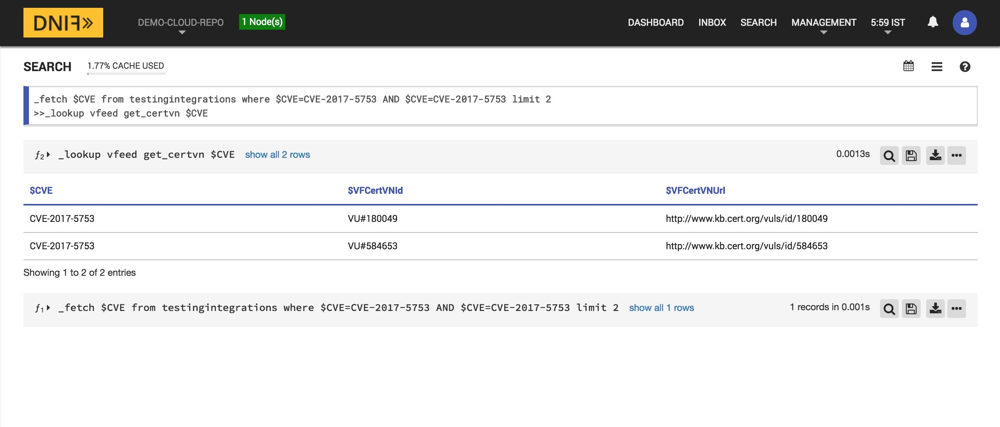

The lookup call returns output in the following structure for available data:

|     Field      |           Description             |
|----------------|-----------------------------------|
| $CVE           | The CVE ID of the vulnerability   |
| $VFCertVNId    | The CertVN CVE ID                 |
| $VFCertVNUrl   | URL for the CertVN vulnerability  |

### Retrieve IAVM vulnerabilities by CVE ID

Report on the vulnerabilities from IAVM associated with the given CVE ID

- input : a CVE ID

```
_fetch $CVE from testingintegrations limit 1
>>_lookup vfeed get_iavm $CVE
```

###### Sample walkthrough screenshot for IAVM

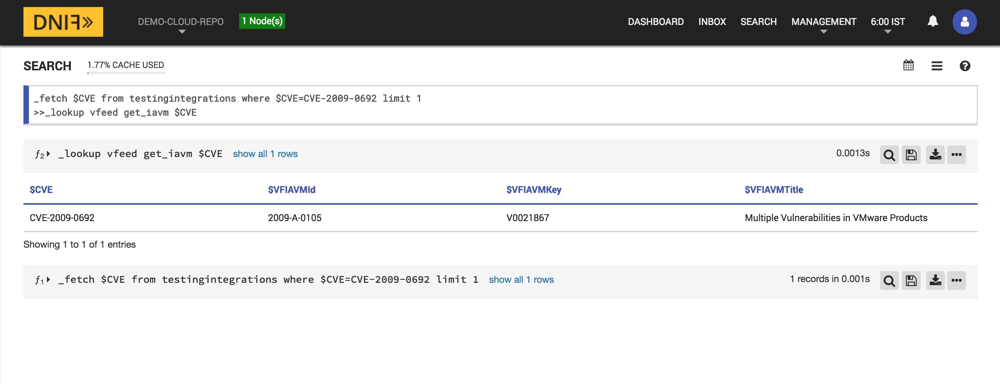

The lookup call returns output in the following structure for available data:

|     Field      |          Description              |
|----------------|-----------------------------------|
| $CVE           | The CVE ID of the vulnerability   |
| $VFIAVMId      | The IAVM CVE ID                   |
| $VFIAVMKey     | IAVM key for the vulnerability    |
| $VFIAVMTitle   | Title for the vulnerability       |

### Retrieve Refs vulnerabilities by CVE ID

Report on the vulnerabilities from Refs associated with the given CVE ID

- input : a CVE ID

```
_fetch $CVE from testingintegrations limit 1
>>_lookup vfeed get_refs $CVE
```

###### Sample walkthrough screenshot for Refs


The lookup call returns output in the following structure for available data:

|     Field      |            Description                |
|----------------|---------------------------------------|
| $CVE           | The CVE ID of the vulnerability       |
| $VFRefsId      | The reference CVE ID                  |
| $VFRefsUrl     | URL for the reference vulnerability   |

### Retrieve SCIP vulnerabilities by CVE ID

Report on the vulnerabilities from SCIP associated with the given CVE ID

- input : a CVE ID

```
_fetch $CVE from testingintegrations limit 1
>>_lookup vfeed get_scip $CVE
```

###### Sample walkthrough screenshot for SCIP


The lookup call returns output in the following structure for available data:

|     Field      |        Description               |
|----------------|----------------------------------|
| $CVE           | The CVE ID of the vulnerability  |
| $VFSCIPId      | The SCIP CVE ID                  |
| $VFSCIPUrl     | URL for the SCIP vulnerability   |

### Retrieve CVSS by CVE ID

CVSS report associated with the given CVE ID

- input : a CVE ID

```
_fetch $CVE from testingintegrations limit 1
>>_lookup vfeed get_cvss $CVE
```

###### Sample walkthrough screenshot for CVSS

[CVSS Walkthrough Video](https://drive.google.com/file/d/1YwuV8KWbWRLUwiL_tToPftvHHCm-Teba/view?usp=sharing)

The lookup call returns output in the following structure for available data:

|         Field           |            Description                |
|-------------------------|---------------------------------------|
| $CVE                    | The CVE ID of the vulnerability       |
| $VFCVSSAccessComplexity | Access complexity of the CVE          |
| $VFCVSSAccessVector     | Access vector of the CVE              |
| $VFCVSSAuthentication   | Authentication of the CVSS            |
| $VFCVSSAvailability     | Availability of the CVE vulnerability |
| $VFCVSSBase             | Base vulnerability of CVE             |
| $VFCVSSConfidentiality  | Confidentiality of the CVE            |
| $VFCVSSExploitability   | Exploitability of the CVE             |
| $VFCVSSImpact           | Impact of the CVE                     |
| $VFCVSSIntegrity        | Integrity of the CVE                  |
| $VFCVSSVector           | Attack vector of the CVE              |

### Retrieve CVSS Severity by CVE ID

CVSS Severity associated with the given CVE ID

- input : a CVE ID

```
_fetch $CVE from testingintegrations limit 1
>>_lookup vfeed get_severity $CVE
```

###### Sample walkthrough screenshot for CVSS Severity

[CVSS Severity Walkthrough Video](https://drive.google.com/file/d/1nlUh9dELbV_lrqFEtcBAEIBLRsP0tu0I/view?usp=sharing)

The lookup call returns output in the following structure for available data:

|         Field           |            Description                |
|-------------------------|---------------------------------------|
| $CVE                    | The CVE ID of the vulnerability       |
| $VFCVSSAccessComplexity | Access complexity of the CVE          |
| $VFCVSSAccessVector     | Access vector of the CVE              |
| $VFCVSSAuthentication   | Authentication of the CVSS            |
| $VFCVSSAvailability     | Availability of the CVE vulnerability |
| $VFCVSSBase             | Base vulnerability of CVE             |
| $VFCVSSConfidentiality  | Confidentiality of the CVE            |
| $VFCVSSExploitability   | Exploitability of the CVE             |
| $VFCVSSImpact           | Impact of the CVE                     |
| $VFCVSSIntegrity        | Integrity of the CVE                  |
| $VFCVSSVector           | Attack vector of the CVE              |
| $VFSeverity             | Severity level of the CVE             |
| $VFTopAlert             | Boolean value for a top alert         |
| $VFTopVulnerable        | Boolean value for a top vulnerability |

### Retrieve Snort vulnerabilities by CVE ID

Report on the vulnerabilities from Snort associated with the given CVE ID

- input : a CVE ID

```
_fetch $CVE from testingintegrations limit 1
>>_lookup vfeed get_snort $CVE
```

###### Sample walkthrough screenshot for Snort


The lookup call returns output in the following structure for available data:

|       Field       |        Description              |
|-------------------|---------------------------------|
| $CVE              | The CVE ID of the vulnerability |
| $VFSnortId        | The Snort CVE ID                |
| $VFSnortCategory  | Snort vulnerability category    |
| $VFSnortSignature | Snort vulnerability signature   |

### Retrieve Suricata vulnerabilities by CVE ID

Report on the vulnerabilities from Suricata associated with the given CVE ID

- input : a CVE ID

```
_fetch $CVE from testingintegrations limit 1
>>_lookup vfeed get_suricata $CVE
```

###### Sample walkthrough screenshot for Suricata


The lookup call returns output in the following structure for available data:

|        Field         |          Description              |
|----------------------|-----------------------------------|
| $CVE                 | The CVE ID of the vulnerability   |
| $VFSuricataId        | The Suricata CVE ID               |
| $VFSuricataClasstype | Suricata vulnerability class type |
| $VFSuricataSignature | Suricata vulnerability signature  |

### Retrieve Nessus vulnerabilities by CVE ID

Report on the vulnerabilities from Nessus associated with the given CVE ID

- input : a CVE ID

```
_fetch $CVE from testingintegrations limit 1
>>_lookup vfeed get_nessus $CVE
```

###### Sample walkthrough screenshot for Nessus


The lookup call returns output in the following structure for available data:

|       Field       |        Description              |
|-------------------|---------------------------------|
| $CVE              | The CVE ID of the vulnerability |
| $VFNessusFamily   | Nessus vulnerability family     |
| $VFNessusFile     | Nessus vulnerability file       |
| $VFNessusID       | Nessus CVE ID                   |
| $VFNessusName     | Name of nessus vulnerability    |

### Retrieve Nmap vulnerabilities by CVE ID

Report on the vulnerabilities from Nmap associated with the given CVE ID

- input : a CVE ID

```
_fetch $CVE from testingintegrations limit 1
>>_lookup vfeed get_nmap $CVE
```

###### Sample walkthrough screenshot for Nmap

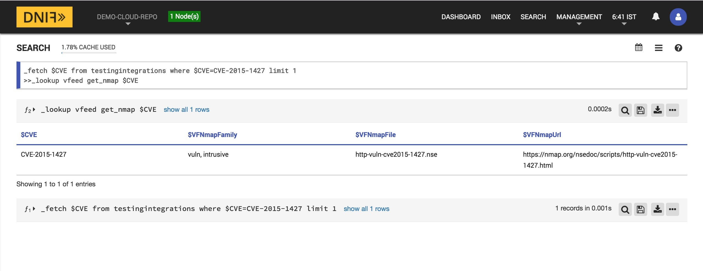

The lookup call returns output in the following structure for available data:

|       Field       |        Description              |
|-------------------|---------------------------------|
| $CVE              | The CVE ID of the vulnerability |
| $VFNmapFamily     | Nmap vulnerability family       |
| $VFNmapFile       | Nmap vulnerability file         |
| $VFNmapUrl        | Nmap vulnerability URL          |

### Retrieve OpenVAS vulnerabilities by CVE ID

Report on the vulnerabilities from OpenVAS associated with the given CVE ID

- input : a CVE ID

```
_fetch $CVE from testingintegrations limit 1
>>_lookup vfeed get_openvas $CVE
```

###### Sample walkthrough screenshot for OpenVAS


The lookup call returns output in the following structure for available data:

|       Field        |        Description              |
|--------------------|---------------------------------|
| $CVE               | The CVE ID of the vulnerability |
| $VFOpenVASFamily   | OpenVAS vulnerability family    |
| $VFOpenVASFile     | OpenVAS vulnerability file      |
| $VFOpenVASID       | OpenVAS CVE ID                  |
| $VFOpenVASName     | Name of OpenVAS vulnerability   |

### Retrieve Oval vulnerabilities by CVE ID

Report on the vulnerabilities from Oval associated with the given CVE ID

- input : a CVE ID

```
_fetch $CVE from testingintegrations limit 1
>>_lookup vfeed get_oval $CVE
```

###### Sample walkthrough screenshot for Oval

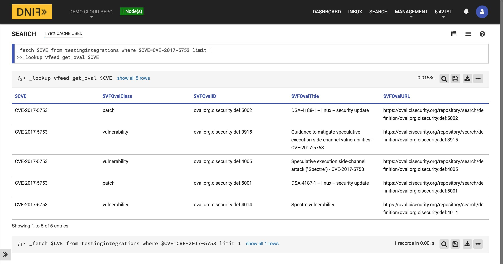

The lookup call returns output in the following structure for available data:

|       Field        |        Description              |
|--------------------|---------------------------------|
| $CVE               | The CVE ID of the vulnerability |
| $VFOvalClass       | Oval vulnerability class        |
| $VFOvalID          | Oval vulnerability ID           |
| $VFOvalTitle       | Oval vulnerability title        |
| $VFOvalURL         | Oval vulnerability URL          |

## Using the vFeed CVE Database with DNIF  
The vFeed CVE Database can be found on the vFeed website at

  https://vfeed.io/

#### Getting started with vFeed CVE Database with DNIF

1. ###### Login to your Data Store, Correlator, and A10 containers.  
   [ACCESS DNIF CONTAINER VIA SSH](https://dnif.it/docs/guides/tutorials/access-dnif-container-via-ssh.html)
2. ###### Move to the `/dnif/<Deployment-key>/lookup_plugins` folder path.
```
$cd /dnif/CnxxxxxxxxxxxxV8/lookup_plugins/
```
3. ###### Clone using the following command  
```  
git clone https://github.com/dnif/lookup-vfeed.git vfeed
```
4. ###### Move to the ‘/dnif/<Deployment-key/lookup_plugins/vfeed/’ folder path and download the vfeed community edition database file. The URL to this file can be obtained by copying the URL that the download button points to in the database.

```     
wget -O vfeed.db "<Database-URL>"
```
